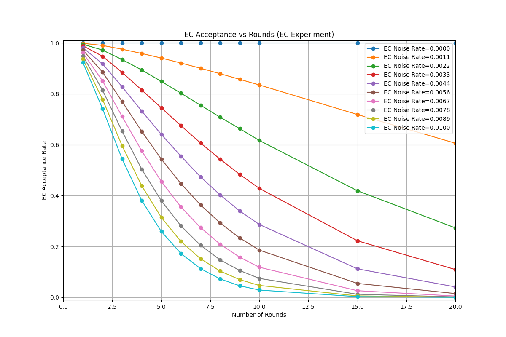
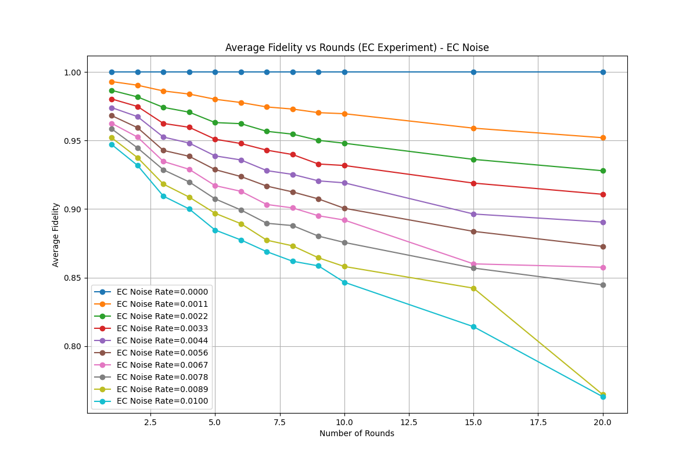
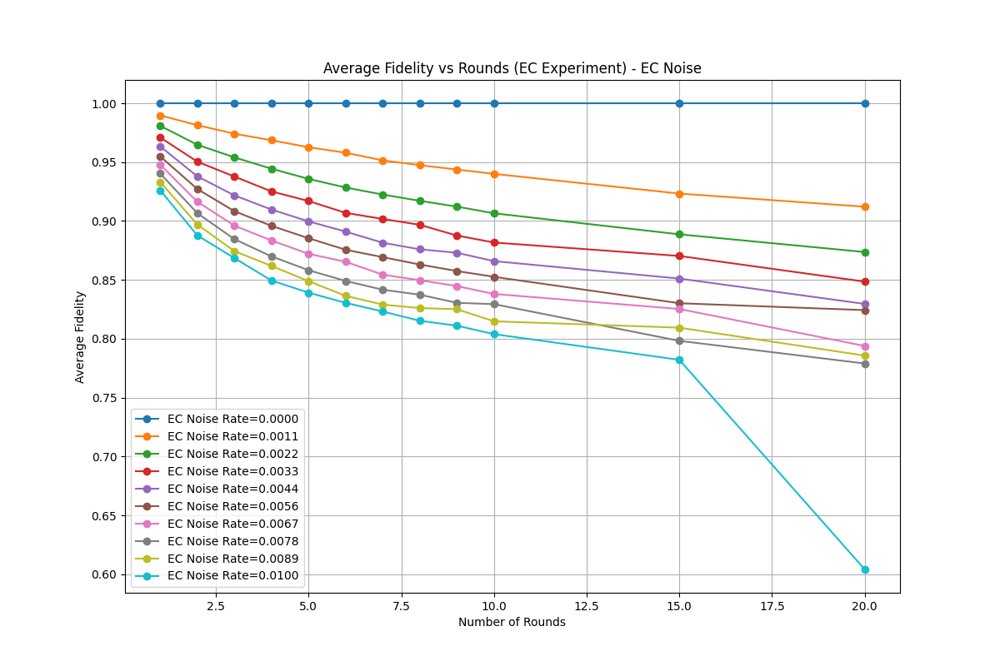

# Stim Implementation of the [[16,4,4]] Tesseract Code

## Overview
• **What it is**: A complete Stim-based [[3]](#references) simulation of the Tesseract quantum error correction code [[1]](#references) with gate-level encoding, error correction rounds, and manual decoding.

• **Why it matters**: The [[16,4,4]] Tesseract subsystem color code offers practical fault tolerance for NISQ devices; encoding 4 logical qubits with single-shot error correction using only 2 ancilla qubits. This makes it viable for current trapped-ion platforms and a stepping stone to larger codes.

• **What's implemented**: Full error correction pipeline including two encoding modes, configurable noise, stabilizer measurement rounds, Pauli frame tracking, and acceptance/fidelity analysis.

• **Validation status**: Error correction improves fidelity as expected, but quantitative reproduction of paper results is work-in-progress. Acceptance rates show correct trend but offset (~1.0 vs ~0.85 baseline); logical error rates have correct shape but ~10× scaling difference.

![Figure 1: Tesseract code structure (from [1])](docs/images/fig1_tesseract_code.png)

## Reproduce the Paper

To regenerate the main results with paper parameters:

```bash
python tesseract_sim/plotting/plot_acceptance_rates.py \
  --shots 10000 \
  --apply_pauli_frame true \
  --encoding-mode 9a \
  --ec-rate-1q 2.9e-5 \
  --ec-rate-2q 1.15e-3 \
  --meas-error-rate 1.47e-3 \
  --rounds 0 1 2 3 4 5 6 7 8 9 10 15 20 25 30 35 40 45 50
```

**Requirements**: Python 3.8+, Stim 1.11+. Install via `pip install -r requirements.txt`.

**Known differences from paper**:
- Depolarizing noise model (vs. experimental noise)
- Pauli frame correction applied post-measurement (vs. pre-measurement)
- No memory decoherence during idle periods
- Noiseless encoding to avoid preselection
- Only two logical Z measurements (due to |++0000⟩ encoding split into [[8,3,2]] codes)

**Disclaimer**: Independent implementation, not affiliated with Microsoft/Quantinuum/original authors.

### Features

- Circuit implementation of the [[16,4,4]] Tesseract subsystem color code [[1]](#references) in Stim, including encoding, error correction rounds and final measurements.
- Simulation of an error correction experiment with configurable noise setting, rounds, shot and more.
- Plotting: sweeping of different parameters and obtaining acceptance rate and logical success rate.

### Implementation details

In order to mimic the original paper's error correction, the different parts of the experiment are implemented at the gate level.
The experiment implemented here is an error correction experiment based on Microsoft's paper[[1]](#references), and resembles the experimental setup shown in Figure 8 below.

![Figure 8: Error correction experiment (from [1])](docs/images/fig8_error_correction_experiment.png)

The experiment goes as follows:

1. **Encoding** - The initial state is encoded using the circuits in Fig. 9a or 9b. This part is noiseless for simplicity.
2. **Channel Noise** - Optional noise is applied on all qubits.
3. **Error correction rounds** - Each round is composed of measureing rows/columns and X/Z stabilizers. Measurements results are saved.
4. **Logical measurements** - Qubits are measured by breaking apart the code into two smaller codes. Each code is the [[8,3,2]] color code [[4]](#references). See [measure_logical_operators_tesseract](tesseract_sim/error_correction/measurement_rounds.py) and [verify_final_state](tesseract_sim/error_correction/decoder_manual.py) for more details.
5. **Post processing** - Each shot is accepted or not (based on the error correction rounds); For accepted rounds, the qubits are corrected based on Pauli frame (if enabled in simulation). Next, logical qubits are measured and validated to determine the logical error rate.

### Code
#### Structure

```
tesseract-code-stim/
├── tesseract_sim/           # Main simulation package
│   ├── common/              # Shared utilities and base components
│   │   ├── circuit_base.py  # Basic circuit operations and initialization
│   │   └── code_commons.py  # Tesseract code definitions (stabilizers, operators)
│   ├── encoding/            # State encoding implementations
│   │   ├── encoding_manual_9a.py  # |++0000⟩ encoding (Fig 9a)
│   │   └── encoding_manual_9b.py  # |+0+0+0⟩ encoding (Fig 9b)
│   ├── error_correction/    # Error correction and measurement
│   │   ├── correction_rules.py     # Correction logic for different error types
│   │   ├── decoder_manual.py       # Manual decoder implementation
│   │   └── measurement_rounds.py   # Stabilizer measurements and rounds
│   ├── noise/               # Noise modeling and injection
│   │   ├── noise_cfg.py     # Noise configuration dataclass
│   │   └── noise_utils.py   # Noise injection utilities
│   ├── plotting/            # Visualization and analysis
│   │   └── plot_acceptance_rates.py  # Generate acceptance/success rate plots
│   └── run.py               # Main simulation entry point
├── notebooks/               # Jupyter notebooks for experiments
│   ├── encoding_circuits_visualization.ipynb    # Circuit visualization
│   ├── entire_experiment_circuit.ipynb          # Complete experiment demo
│   └── tesseract_stim_simulation_real_decoder.ipynb  # Full simulation
├── tests/                   # Test suite
│   ├── encoding/            # Encoding tests
│   ├── noise/               # Noise injection tests
│   └── test_*.py            # Various experiment and functionality tests
├── plots/                   # Generated plot outputs
├── requirements.txt         # Python dependencies
└── setup.py                 # Package configuration
```

#### Key Components

- **`tesseract_sim/run.py`**: Main entry point for running simulations with configurable noise parameters
- **`tesseract_sim/encoding/`**: Two encoding modes based on paper figures 9a and 9b
- **`tesseract_sim/error_correction/`**: Manual decoder with correction rules and measurement rounds
- **`tesseract_sim/noise/`**: Configurable noise injection for encoding and error correction phases
- **`tesseract_sim/plotting/`**: Analysis and visualization tools for acceptance rates and logical success rates
- **`notebooks/`**: Interactive Jupyter notebooks for experiments and visualization
- **`tests/`**: Comprehensive test suite covering all major functionality

## Results

### Error Correction Demonstration

First, we show the acceptance rates across different noise levels and number of error correction rounds:



The plots below demonstrate the error correction procedure by comparing fidelity with and without Pauli frame correction applied. Both experiment run the full error correction rounds, but only the experiment plotted in the left plot applies the corrections based on the accumulated Pauli frame.

<table>
<tr>
<td align="center">

<br/>
<b>With Pauli Frame Correction</b>
</td>
<td align="center">

<br/>
<b>Without Pauli Frame Correction</b>
</td>
</tr>
</table>

This comparison clearly shows that the error correction procedure manages to correct some of the errors and achieve higher fidelity across different noise levels and number of error correction rounds.

## Quick Start

### Installation

```bash
# Clone the repository
git clone https://github.com/DeDuckProject/tesseract-code-stim.git
cd tesseract-code-stim

# Create and activate a virtual environment (recommended)
python -m venv venv
source venv/bin/activate  # On Windows: venv\Scripts\activate

# Install dependencies
pip install -r requirements.txt
```

The main workflow is through Jupyter notebooks. After installation:

```bash
jupyter notebook
```

Then navigate to one of the notebooks to run experiments and simulations.

### Running Simulations

The `tesseract_sim/run.py` script supports configurable noise injection during encoding and error correction phases. You can control whether noise is active and set independent 1-qubit and 2-qubit error rates for each phase.

```bash
python -m tesseract_sim.run --help
```

**Example Usages:**

*   **Run simulation with default settings (no noise):**
    ```bash
    python -m tesseract_sim.run
    ```

*   **Run simulation with encoding noise enabled (1-qubit rate 0.001, 2-qubit rate 0.002):**
    ```bash
    python -m tesseract_sim.run --enc-active --enc-rate-1q 0.001 --enc-rate-2q 0.002
    ```

*   **Run simulation with error correction noise enabled (1-qubit rate 0.003, 2-qubit rate 0.004):**
    ```bash
    python -m tesseract_sim.run --ec-active --ec-rate-1q 0.003 --ec-rate-2q 0.004
    ```

*   **Run simulation with both encoding and error correction noise:**
    ```bash
    python -m tesseract_sim.run --enc-active --enc-rate-1q 0.001 --ec-active --ec-rate-1q 0.003 --rounds 5 --shots 5000
    ```

*   **Run simulation with noise enabled but zero rates (effectively no noise):**
    ```bash
    python -m tesseract_sim.run --enc-active --enc-rate-1q 0.0 --ec-active --ec-rate-1q 0.0
    ```

### Plotting Results

The `plotting/plot_acceptance_rates.py` script generates acceptance and logical success rate plots from simulation data. It supports different encoding modes and Pauli frame correction settings.

**Example Usages:**

*   **Generate plots with Pauli frame correction enabled and 9a encoding:**
    ```bash
    python tesseract_sim/plotting/plot_acceptance_rates.py --apply_pauli_frame true --encoding-mode 9a
    ```

*   **Generate plots with Pauli frame correction disabled and 9a encoding:**
    ```bash
    python tesseract_sim/plotting/plot_acceptance_rates.py --apply_pauli_frame false --encoding-mode 9a
    ```

*   **Generate plots with 9b encoding and custom shot count:**
    ```bash
    python tesseract_sim/plotting/plot_acceptance_rates.py --apply_pauli_frame true --encoding-mode 9b --shots 5000
    ```

*   **Generate plots with channel noise sweep instead of EC noise:**
    ```bash
    python tesseract_sim/plotting/plot_acceptance_rates.py --apply_pauli_frame true --encoding-mode 9a --sweep-channel-noise
    ```

*   **Specify custom output directory:**
    ```bash
    python tesseract_sim/plotting/plot_acceptance_rates.py --apply_pauli_frame true --encoding-mode 9a --out-dir ./custom_plots
    ```

*   **Customize rounds and noise levels:**
    ```bash
    python tesseract_sim/plotting/plot_acceptance_rates.py --rounds 1 5 10 20 --noise-levels 0.01 0.05 0.1 --shots 1000
    ```

The script generates three types of plots:
- **Acceptance Rate Plots**: Show how well the error correction accepts states across different noise levels and rounds
- **Logical Success Rate Plots**: Show the conditional probability of logical success given acceptance. Logical success is defined here as all qubits are measured to be in the correct state.
- **Fidelity Rate Plots**: Show the average fidelity of the measured logical state within the shots that were not rejected. 

## References

[1] B. W. Reichardt et al., "Demonstration of quantum computation and error correction with a tesseract code", (2024) [arXiv:2409.04628](https://arxiv.org/abs/2409.04628)

[2] "\([[16,6,4]]\) Tesseract color code", The Error Correction Zoo (V. V. Albert & P. Faist, eds.), 2024. https://errorcorrectionzoo.org/c/stab_16_6_4

[3] C. Gidney, "Stim: a fast stabilizer circuit simulator", Quantum 5, 497 (2021). https://doi.org/10.22331/q-2021-07-06-497

[4] E. Campbell, "The smallest interesting colour code", (2016). https://earltcampbell.com/2016/09/26/the-smallest-interesting-colour-code/

## License

MIT License 